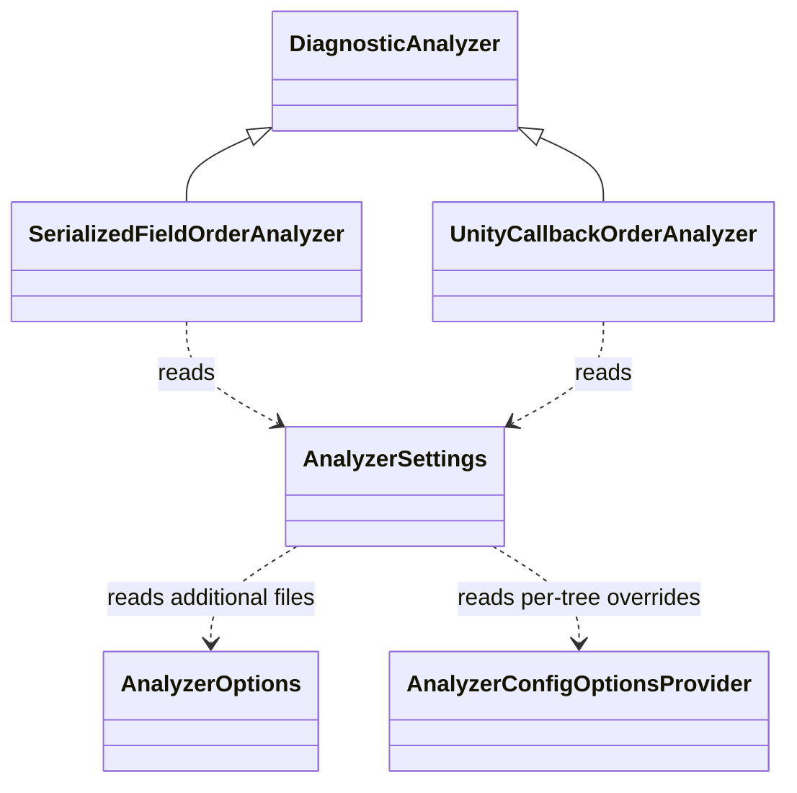
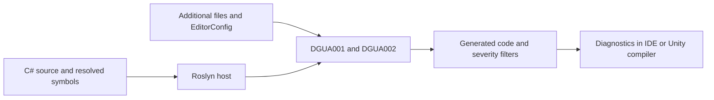

# Unity ordering analyzers — 0.1.0

## Authorization and checkout

2026-10-05: user requested implementation in an independent reusable repository, then approved
`C:/Programming/Unity/DraasGames.Unity.Analyzers`, UPM distribution, and the two rules below.
This directory is the authoritative checkout. No mirror or ConstructionSimulator integration is required.
Source, package, build and test artifacts belong here. No commit or publication has been requested.

## Contracts

- `DGUA001`: explicitly serialized instance fields precede other instance fields by default.
  A marker must resolve semantically to `UnityEngine.SerializeField`, `UnityEngine.SerializeReference`,
  or `Sirenix.Serialization.OdinSerializeAttribute`; aliases work, unrelated short names do not.
  This is a declaration grouping rule, not a validator of Unity/Odin serializability. In particular,
  public fields without these attributes are ordinary fields; readonly and NonSerialized do not
  remove an explicit marker. Static and constant fields are ignored entirely.
  Analyze class/struct declarations independently, including nested and partial declarations.
  Report each marked field after an ordinary field when placement is `first`; for `last`, report
  each ordinary field after a marked field. Identifier location; one diagnostic per declaration.
- `DGUA002`: recognized Unity callbacks follow the configured relative order within each type
  declaration. Defaults: Reset, OnValidate, Awake, OnEnable, Start, FixedUpdate, Update,
  LateUpdate, OnDisable, OnDestroy. Only semantic descendants of MonoBehaviour or ScriptableObject
  qualify. For ScriptableObject, only OnValidate, Awake, OnEnable, OnDisable, OnDestroy qualify.
  Methods must be ordinary nonstatic nongeneric parameterless nonabstract methods, with a body,
  returning void; MonoBehaviour Start may also return exactly System.Collections.IEnumerator.
  Noncallbacks are ignored and need not be contiguous. For each inversion, report the later
  method's identifier against the highest-ranked preceding callback. Missing callbacks are fine.
- Generated code is excluded by Roslyn flags; no global mutable state or filesystem reads in analyzer code.
- Diagnostics are enabled warnings, independently controlled by normal Roslyn severity settings.
- Initial release provides diagnostics. Reordering fields can change initializer behavior, so automatic
  source rewrites are outside this release's scope.

## Settings

`draas_unity_serialized_field_placement = first|last`

`draas_unity_callback_order = Reset,OnValidate,Awake,OnEnable,Start,FixedUpdate,Update,LateUpdate,OnDisable,OnDestroy`

Settings are read in this order (later wins): built-in defaults; matching additional files sorted
by ordinal path; tree-specific AnalyzerConfigOptions (.editorconfig when supplied by host).
Additional files must have the suffix `.DraasGames.Unity.Analyzers.additionalfile` and a nonempty
prefix without dots, such as `Settings.DraasGames.Unity.Analyzers.additionalfile`.
Format: UTF-8 key=value, blank lines and lines starting with # or ; ignored; unknown keys ignored.
Later occurrences of a key win. Only nonempty duplicate-free subsets/permutations of the ten supported
callbacks are valid; omitted callbacks are not checked. Invalid option values fall back to built-in
defaults for that option, not to earlier layers. Trim values; option names and callback names are case-sensitive.
Placement values are lowercase. Cancellation must propagate.
No hard dependency on UnityEngine, Odin, StyleCop, or Workspaces assemblies.

## Architecture

- SerializedFieldOrderAnalyzer owns DGUA001.
- UnityCallbackOrderAnalyzer owns DGUA002 and callback signature/type recognition.
- AnalyzerSettings loads immutable per-compilation additional-file settings, then resolves per-tree overrides.
- Analyzer DLL targets netstandard2.0, Microsoft.CodeAnalysis 3.8 API baseline.
- UPM package has a prebuilt labeled DLL outside any asmdef and disabled runtime import.
- Examples provide Unity additional-file settings, .editorconfig and .ruleset; never overwrite consumer configuration.

## Stages and ownership

| Stage | Owner | Allowed files | State |
| --- | --- | --- | --- |
| Contracts, settings, integration | Current coordinator | root files, docs, AnalyzerSettings.cs | Complete; integrated and reviewed |
| Serialized field rule | Luna max executor | SerializedFieldOrderAnalyzer.cs only | Complete; approved behavioral checks passed |
| Unity callback rule | Luna max executor | UnityCallbackOrderAnalyzer.cs only | Complete; approved behavioral checks passed |
| UPM packaging | Coordinator | package/, scripts/ | Complete; prebuilt DLL and tarball available |
| Verification | Separate Luna max verifier | tests/, artifacts/verification.md | Complete; Release 0 warnings/errors, 15/15 tests |

Shared contract: internal `AnalyzerSettings.Load(AnalyzerOptions, CancellationToken)` returns settings;
`settings.ForTree(AnalyzerConfigOptionsProvider, SyntaxTree)` returns effective settings;
`SerializedFieldsFirst` bool; `CallbackOrder` ImmutableArray<string>. Agents must not modify shared files.
All work stays in this checkout. Build is ordinary .NET analyzer compilation, not a Unity project build.
Unity import, real compiler host loading and Rider highlighting require separate integration evidence.

## Proposed tests — pending approval

All names are methods in `DraasGames.Unity.Analyzers.Tests.OrderingAnalyzerTests`.
Action for every row: ADD and RUN through public Roslyn CompilationWithAnalyzers, with independent expected diagnostics.
No production test-only seams. A parameterized case remains within its stated row contract.

| Name | Scenario and expected behavior |
| --- | --- |
| SerializedFieldsFirst_NoDiagnostic | Correct marked-first declarations produce none. |
| SerializedFieldAfterOrdinaryField_Reports | All three semantic markers and aliases report the offending marked identifier. |
| StaticAndConstFields_DoNotAffectOrdering | Static and const fields never split the ordered instance groups. |
| UnrelatedAttributes_AreIgnored | Unrelated equal short names are not markers. |
| SerializedFieldsLast_UsesConfiguration | Additional-file last setting reports ordinary fields following marked fields. |
| Ordering_IsLocalToTypeDeclaration | Nested and partial declarations do not influence each other. |
| UnityCallbacksOutOfOrder_Report | Inversions in derived MonoBehaviour/ScriptableObject report identifier, including indirect inheritance. |
| UnityCallbacksInConfiguredOrder_NoDiagnostic | Default and custom callback order/subset accept the configured order. |
| OrdinaryMethodsAndInvalidSignatures_AreIgnored | Non-Unity classes, static, generic, parameterized and unsupported return types are ignored; ScriptableObject Update ignored. |
| CoroutineStart_IsRecognized | IEnumerator Start participates in MonoBehaviour order. |
| GeneratedCode_IsIgnored | Both rules ignore generated header and generated filename. |
| EditorConfig_OverridesAdditionalFile | Both option overrides supersede additional-file configuration. |
| InvalidOptions_UseDefaults | Invalid placement and invalid/duplicate/empty callback order use defaults without AD0001. |
| AdditionalFiles_AreFilteredAndMergedDeterministically | Foreign filenames ignored; valid files merged in ordinal path order independent of supplied enumeration. |
| DisabledRules_DoNotReport | Each diagnostic can be suppressed through Roslyn compilation options. |

Build + package creation + metadata inspection do not imply behavioral or Unity validation.
Acceptance requires approved behavioral tests, successful Release analyzer build and a reusable UPM archive.
Implementation acceptance: achieved for the standalone analyzer and UPM packaging scope.
Unity host/consumer import and Rider highlighting remain explicitly unverified, as recorded in validation.md.

