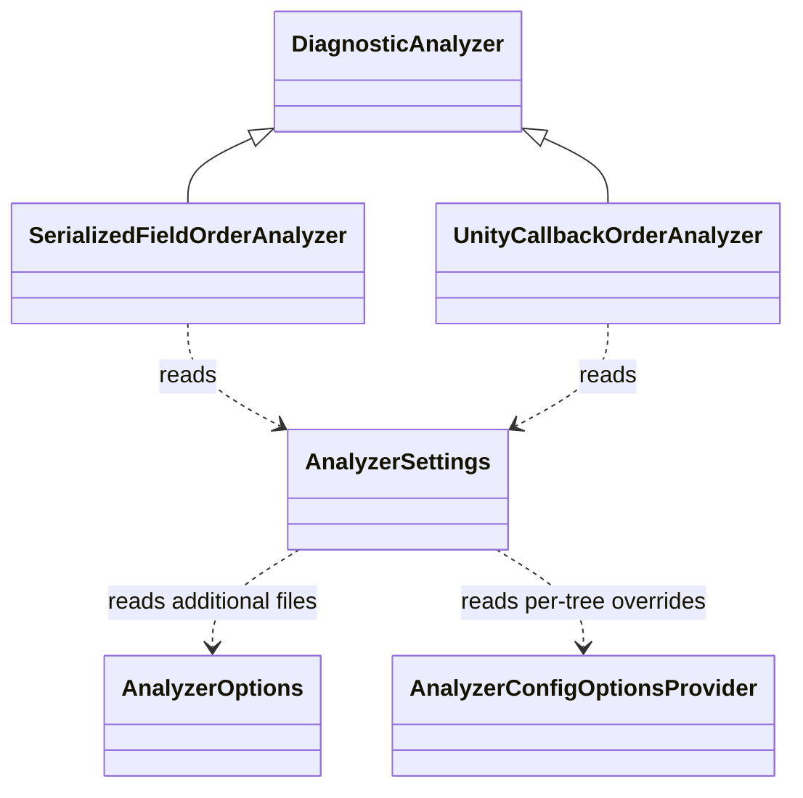
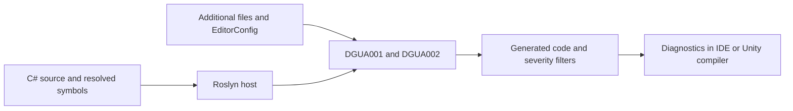

# Unity ordering analyzers — 0.1.0

Latest feature: [IDE code fixes — 0.2.0](code-fixes-specification.md). Its separate IDE assembly and
explicit source transformations extend the diagnostic-only contracts below. Historical release sections
are retained as implementation and approval records.

## Authorization and checkout

2026-10-05: user requested implementation in an independent reusable repository, then approved
`C:/Programming/Unity/DraasGames.Unity.Analyzers`, UPM distribution, and the two rules below.
This directory is the authoritative checkout. No mirror or ConstructionSimulator integration is required.
Source, package, build and test artifacts belong here. No commit or publication has been requested.

## Contracts

- `DGUA001`: explicitly serialized instance fields precede other instance fields by default.
  A marker must resolve semantically to `UnityEngine.SerializeField`, `UnityEngine.SerializeReference`,
  or `Sirenix.Serialization.OdinSerializeAttribute`; aliases work, unrelated short names do not.
  This is a declaration grouping rule, not a validator of Unity/Odin serializability. In particular,
  public fields without these attributes are ordinary fields; readonly and NonSerialized do not
  remove an explicit marker. Static and constant fields are ignored entirely.
  Analyze class/struct declarations independently, including nested and partial declarations.
  Report each marked field after an ordinary field when placement is `first`; for `last`, report
  each ordinary field after a marked field. Identifier location; one diagnostic per declaration.
- `DGUA002`: recognized Unity callbacks follow the configured relative order within each type
  declaration. Defaults: Reset, OnValidate, Awake, OnEnable, Start, FixedUpdate, Update,
  LateUpdate, OnDisable, OnDestroy. Only semantic descendants of MonoBehaviour or ScriptableObject
  qualify. For ScriptableObject, only OnValidate, Awake, OnEnable, OnDisable, OnDestroy qualify.
  Methods must be ordinary nonstatic nongeneric parameterless nonabstract methods, with a body,
  returning void; MonoBehaviour Start may also return exactly System.Collections.IEnumerator.
  Checked callbacks must precede ordinary methods by default (see the 0.1.1 extension below).
  Relative callback order is always enforced. Missing callbacks are fine.
- Generated code is excluded by Roslyn flags; no global mutable state or filesystem reads in analyzer code.
- Diagnostics are enabled warnings, independently controlled by normal Roslyn severity settings.
- Initial release provides diagnostics. Reordering fields can change initializer behavior, so automatic
  source rewrites are outside this release's scope.

## Settings

`draas_unity_serialized_field_placement = first|last`

`draas_unity_callback_order = Reset,OnValidate,Awake,OnEnable,Start,FixedUpdate,Update,LateUpdate,OnDisable,OnDestroy`

`draas_unity_callbacks_before_other_methods = true|false` (default: true, since 0.1.1)

Settings are read in this order (later wins): built-in defaults; matching additional files sorted
by ordinal path; tree-specific AnalyzerConfigOptions (.editorconfig when supplied by host).
Additional files must have the suffix `.DraasGames.Unity.Analyzers.additionalfile` and a nonempty
prefix without dots, such as `Settings.DraasGames.Unity.Analyzers.additionalfile`.
Format: UTF-8 key=value, blank lines and lines starting with # or ; ignored; unknown keys ignored.
Later occurrences of a key win. Only nonempty duplicate-free subsets/permutations of the ten supported
callbacks are valid; omitted callbacks are not checked. Invalid option values fall back to built-in
defaults for that option, not to earlier layers. Trim values; option names and callback names are case-sensitive.
Placement values are lowercase. Cancellation must propagate.
No hard dependency on UnityEngine, Odin, StyleCop, or Workspaces assemblies.

## Architecture

- SerializedFieldOrderAnalyzer owns DGUA001.
- UnityCallbackOrderAnalyzer owns DGUA002 and callback signature/type recognition.
- AnalyzerSettings loads immutable per-compilation additional-file settings, then resolves per-tree overrides.
- Analyzer DLL targets netstandard2.0, Microsoft.CodeAnalysis 3.8 API baseline.
- UPM package has a prebuilt labeled DLL outside any asmdef and disabled runtime import.
- Examples provide Unity additional-file settings, .editorconfig and .ruleset; never overwrite consumer configuration.

## Stages and ownership

| Stage | Owner | Allowed files | State |
| --- | --- | --- | --- |
| Contracts, settings, integration | Current coordinator | root files, docs, AnalyzerSettings.cs | Complete; integrated and reviewed |
| Serialized field rule | Luna max executor | SerializedFieldOrderAnalyzer.cs only | Complete; approved behavioral checks passed |
| Unity callback rule | Luna max executor | UnityCallbackOrderAnalyzer.cs only | Complete; approved behavioral checks passed |
| UPM packaging | Coordinator | package/, scripts/ | Complete; prebuilt DLL and tarball available |
| Verification | Separate Luna max verifier | tests/, artifacts/verification.md | Complete; Release 0 warnings/errors, 15/15 tests |

Shared contract: internal `AnalyzerSettings.Load(AnalyzerOptions, CancellationToken)` returns settings;
`settings.ForTree(AnalyzerConfigOptionsProvider, SyntaxTree)` returns effective settings;
`SerializedFieldsFirst` bool; `CallbackOrder` ImmutableArray<string>. Agents must not modify shared files.
All work stays in this checkout. Build is ordinary .NET analyzer compilation, not a Unity project build.
Unity import, real compiler host loading and Rider highlighting require separate integration evidence.

## Proposed tests — pending approval

All names are methods in `DraasGames.Unity.Analyzers.Tests.OrderingAnalyzerTests`.
Action for every row: ADD and RUN through public Roslyn CompilationWithAnalyzers, with independent expected diagnostics.
No production test-only seams. A parameterized case remains within its stated row contract.

| Name | Scenario and expected behavior |
| --- | --- |
| SerializedFieldsFirst_NoDiagnostic | Correct marked-first declarations produce none. |
| SerializedFieldAfterOrdinaryField_Reports | All three semantic markers and aliases report the offending marked identifier. |
| StaticAndConstFields_DoNotAffectOrdering | Static and const fields never split the ordered instance groups. |
| UnrelatedAttributes_AreIgnored | Unrelated equal short names are not markers. |
| SerializedFieldsLast_UsesConfiguration | Additional-file last setting reports ordinary fields following marked fields. |
| Ordering_IsLocalToTypeDeclaration | Nested and partial declarations do not influence each other. |
| UnityCallbacksOutOfOrder_Report | Inversions in derived MonoBehaviour/ScriptableObject report identifier, including indirect inheritance. |
| UnityCallbacksInConfiguredOrder_NoDiagnostic | Default and custom callback order/subset accept the configured order. |
| OrdinaryMethodsAndInvalidSignatures_AreIgnored | Non-Unity classes, static, generic, parameterized and unsupported return types are ignored; ScriptableObject Update ignored. |
| CoroutineStart_IsRecognized | IEnumerator Start participates in MonoBehaviour order. |
| GeneratedCode_IsIgnored | Both rules ignore generated header and generated filename. |
| EditorConfig_OverridesAdditionalFile | Both option overrides supersede additional-file configuration. |
| InvalidOptions_UseDefaults | Invalid placement and invalid/duplicate/empty callback order use defaults without AD0001. |
| AdditionalFiles_AreFilteredAndMergedDeterministically | Foreign filenames ignored; valid files merged in ordinal path order independent of supplied enumeration. |
| DisabledRules_DoNotReport | Each diagnostic can be suppressed through Roslyn compilation options. |

Build + package creation + metadata inspection do not imply behavioral or Unity validation.
Acceptance requires approved behavioral tests, successful Release analyzer build and a reusable UPM archive.
Implementation acceptance: achieved for the standalone analyzer and UPM packaging scope.
Unity host/consumer import and Rider highlighting remain explicitly unverified, as recorded in validation.md.

## Extension 0.1.1 — callbacks before ordinary methods

User clarification on 2026-10-05: Awake must precede ordinary methods. The previous implementation
only compared Unity callbacks with one another and intentionally allowed helper methods between them.
This extension updates DGUA002; no new diagnostic ID or automatic code fixes are introduced.

### Behavior

- New option: `draas_unity_callbacks_before_other_methods`, default `true`. Accept trimmed `true` or `false`
  case-insensitively; invalid/empty values fall back to true. Use the existing additional-file merge and
  tree-level EditorConfig precedence. No filesystem access in analyzers.
- When enabled, each checked callback after the first ordinary method in the same declaration gets DGUA002.
  Instance, static, generic, override and explicit-interface methods count as ordinary methods unless they
  are recognized Unity callbacks. Fields, constructors, properties and nested type members do not count.
  Abstract ordinary method declarations count; invalid Unity signatures are ordinary methods.
- A valid supported callback omitted from `draas_unity_callback_order` remains completely ignored;
  do not reclassify it as an ordinary method and cause indirect diagnostics.
- Recognition first checks the full supported callback set for the current Unity base type/signature;
  a noncallback becomes an ordinary-method boundary, a recognized omitted callback is skipped,
  and only configured callbacks participate in DGUA002 ordering and positioning.
- When false, restore the previous behavior: only relative callback order is checked.
- At most one DGUA002 per callback. Prefer the ordinary-method positioning violation when both kinds
  apply, otherwise report the relative callback inversion. Always update the highest preceding callback
  rank even when a placement diagnostic was reported. Point at the callback identifier and identify
  the preceding method in an actionable diagnostic message.
- Keep partial/nested declarations independent and generated code excluded. No mutations in the consumer project.

### Ownership and progress

| Stage | Owner | Files | State |
| --- | --- | --- | --- |
| Production implementation | Luna max executor | AnalyzerSettings.cs, UnityCallbackOrderAnalyzer.cs | Implemented; integrated review passed |
| Contract, version and documentation | Coordinator | docs/, README.md, package text/examples, Directory.Build.props | Updated for 0.1.1 |
| Behavioral verification | Separate Luna max verifier | tests/, artifacts/ | Release analyzer build passed, 0 warnings/errors; extension test approval pending |

Authoritative checkout: C:/Programming/Unity/DraasGames.Unity.Analyzers. No Unity mirror.
The verifier owns build/test execution; no concurrent production edits during the final build/test run.
Use a separate artifact-only baseline snapshot if demonstrating the new regression against pre-extension code.

### Historical 0.1.1 test proposal — superseded by 0.1.2

This intermediate proposal was not executed. The approved consolidated 0.1.2 table below replaces it.
All test methods belong to DraasGames.Unity.Analyzers.Tests.OrderingAnalyzerTests.

| Name | Action | Scenario and expected result |
| --- | --- | --- |
| UnityCallbackAfterOrdinaryMethod_Reports | Add/run | Awake and other checked callbacks after ordinary methods report DGUA002, including MonoBehaviour/ScriptableObject and helper/override/static/generic methods; one diagnostic per offending callback. |
| UnityCallbacksBeforeOrdinaryMethods_NoDiagnostic | Add/run | Callbacks before helpers are valid; preceding fields, constructors and properties do not create a method boundary. |
| CallbackPlacementDisabled_PreservesRelativeOrder | Add/run | Additional-file false allows helpers before callbacks while callback inversions still report. |
| OmittedCallbacks_DoNotBecomeOrdinaryMethods | Add/run | Recognized callbacks omitted from the configured subset are skipped without indirect placement warnings. |
| OrdinaryMethodsAndInvalidSignatures_AreIgnored | Change/run | Existing signature/type negative controls use placement=false to retain the isolated recognition contract. |
| EditorConfig_OverridesAdditionalFile | Change/run | Both directions of placement-option override use the tree-level value; prior two option contracts remain. |
| InvalidOptions_UseDefaults | Change/run | Invalid/empty placement bool falls back to true without AD0001; prior invalid option contracts remain. |

Run the 12 unchanged baseline tests from the already approved 15-method table as regression coverage,
for 19 methods total after approval. Public Roslyn diagnostics remain the only assertion boundary;
no test-only production seams. New placement regression must fail on the baseline and pass on the new source.
Release build + 19/19 approved tests + refreshed DLL and UPM archive are the extension acceptance gate.
Actual Unity/Rider consumer integration remains separate and must not be reported as verified from .NET tests.

## Extension 0.1.2 — all Unity methods before ordinary methods

User clarification 2026-10-05: ALL Unity methods must precede ordinary methods in Unity classes.
This section supersedes the limited message catalog and omitted-callback placement exception in 0.1.1.

### Contract

- Separate classification/placement from relative ordering. Every recognized Unity method participates
  in the leading Unity-method group when callbacks_before_other_methods is true, even if absent from
  callback_order. The relative-order list retains the existing ten lifecycle names and only ranks those
  included names. Unranked Unity methods neither reset nor advance that rank.
- Keep DGUA002 and one diagnostic per offending method. Placement remains higher priority than relative order.
- Recognize documented MonoBehaviour messages including parameterized physics, animation, audio, input,
  rendering, particle, transform, GUI and application callbacks. Include ScriptableObject Reset and other
  callbacks. Resolve full parameter/return types semantically; match static/instance and ref kinds correctly.
- Recognize messages for the catalog's Unity Editor/runtime host classes (EditorWindow, Editor,
  ScriptableWizard, AssetPostprocessor, ScriptedImporter, StateMachineBehaviour, UIBehaviour and legacy
  NetworkBehaviour), including correct static callbacks. Use inherited message catalogs.
- Recognize actual overrides whose overridden member chain originates in UnityEngine.* or UnityEditor.*,
  and actual implementations of interfaces in those Unity namespaces, including explicit implementations.
  Namespace alone on the user-defined method does not make it a Unity callback. Zenject.InstallBindings
  remains an ordinary method, because its overridden contract is not declared by Unity.
- Scope includes subclasses of known message hosts / UnityEngine.Object, classes with a UnityEngine or
  UnityEditor base symbol (including PropertyDrawer), and classes implementing Unity interfaces.
  Ordinary non-Unity classes with coincidentally named methods are excluded.
- Keep generated-code, partial and nested-declaration boundaries. Fields, properties and constructors
  do not divide method groups. Preserve callbacks_before_other_methods=false as the opt-out.
- No new Unity or third-party runtime dependencies. Use a static catalog + Roslyn symbols.
- Catalog reference: Microsoft.Unity.Analyzers UnityStubs.cs at fd250c39b858921df0f9479926338b0bad6259fb
  (MIT), cross-checked against Unity 6 scripting documentation. Retain license attribution for adapted data.

### Ownership

| Stage | Owner | Files | State |
| --- | --- | --- | --- |
| Classification/catalog | Luna max catalog executor | UnityCallbackClassifier.cs, UnityMessageCatalog.cs, docs/unity-callbacks.md | Implemented and reviewed; source frozen for verification |
| Ordering integration | Luna max integration executor | UnityCallbackOrderAnalyzer.cs | Implemented and reviewed; source frozen for verification |
| Documentation/version/license | Coordinator | docs except unity-callbacks.md, package text/examples, root docs/props | Updated for 0.1.2, including catalog attribution and assembly scope guide |
| Build and approved verification | Separate verifier | artifacts/, approved tests only | Complete: baseline regression reproduced, Release build clean, 23/23 tests passed, package metadata/content verified and DLL hashes matched |

Shared API: internal static UnityCallbackClassifier.IsUnityType(INamedTypeSymbol) and
IsUnityMethod(IMethodSymbol, CancellationToken). Methods have no I/O or mutable shared state.
Do not author/change/run new tests until their complete proposed scope is explicitly approved.
Previous unapproved test proposals are superseded where they said omitted callbacks were ignored entirely.

### Consolidated 0.1.2 tests — approved 2026-10-05

The user explicitly approved adding 8, changing 3 and running the complete 23-method suite on 2026-10-05.
This replaces the pending 0.1.1 proposal.
Four original-scope additions from 0.1.1 plus four classification additions produce 23 methods total.
The ordinary-method and API-family examples below are independent handwritten contract cases, not generated
from the production catalog. All use public CompilationWithAnalyzers without internal access or test seams.

| Test name | Action | Scenario and expected result |
| --- | --- | --- |
| SerializedFieldsFirst_NoDiagnostic | Run unchanged | Correct marked-first fields produce no diagnostic. |
| SerializedFieldAfterOrdinaryField_Reports | Run unchanged | Each Unity/Odin marker and alias produces DGUA001 on a late marked field. |
| StaticAndConstFields_DoNotAffectOrdering | Run unchanged | Static/const declarations do not split field groups. |
| UnrelatedAttributes_AreIgnored | Run unchanged | Foreign attributes with matching short names are not serialization markers. |
| SerializedFieldsLast_UsesConfiguration | Run unchanged | Last placement reports ordinary fields below marked fields. |
| Ordering_IsLocalToTypeDeclaration | Run unchanged | Nested and partial declaration order remains independent. |
| UnityCallbacksOutOfOrder_Report | Run unchanged | Known MonoBehaviour/ScriptableObject callback inversions report DGUA002. |
| UnityCallbacksInConfiguredOrder_NoDiagnostic | Run unchanged | Correct default/custom callback order produces none. |
| OrdinaryMethodsAndInvalidSignatures_AreIgnored | Change/run | Use placement=false to isolate invalid signatures and non-Unity class recognition. |
| CoroutineStart_IsRecognized | Run unchanged | IEnumerator Start participates in relative callback order. |
| GeneratedCode_IsIgnored | Run unchanged | Generated headers/filenames remain excluded. |
| EditorConfig_OverridesAdditionalFile | Change/run | New placement bool overrides in both directions; existing two option contracts preserved. |
| InvalidOptions_UseDefaults | Change/run | Invalid/empty placement bool uses true without AD0001; existing invalid-option cases preserved. |
| AdditionalFiles_AreFilteredAndMergedDeterministically | Run unchanged | Foreign configs ignored; ordinal path merge is stable. |
| DisabledRules_DoNotReport | Run unchanged | Either diagnostic can be independently suppressed. |
| UnityCallbackAfterOrdinaryMethod_Reports | Add/run | Awake and other Unity callbacks after helper/static/generic/override methods report exactly once per method, including combined relative+placement violation. |
| UnityCallbacksBeforeOrdinaryMethods_NoDiagnostic | Add/run | Unity methods first are valid; fields, constructors and properties do not form boundaries. |
| CallbackPlacementDisabled_PreservesRelativeOrder | Add/run | Additional-file false allows helpers above callbacks while relative inversions still report. |
| UnrankedUnityCallbacks_StillPrecedeOrdinaryMethods | Add/run | OnTriggerEnter and omitted lifecycle callbacks still report below helpers, but have no effect on configured relative rank. |
| ExtendedUnityMessages_RespectSignatures | Add/run | Handwritten physics 2D/3D, application(bool), audio(float[],int), rendering(RenderTexture pair), transform/particle/GUI, SO Reset, EditorWindow.CreateGUI and static AssetPostprocessor cases classify; wrong signature counterparts do not. |
| UnityApiOverrides_AreGroupedBeforeOrdinaryMethods | Add/run | Unity-origin StateMachineBehaviour/Editor/PropertyDrawer virtual overrides classify through intermediate bases; Zenject-like/user/System.Object-only overrides remain ordinary. |
| UnityInterfaceMethods_AreGroupedBeforeOrdinaryMethods | Add/run | Implicit and explicit serialization/EventSystems/Playable interface implementations classify; same-named methods without interface contracts do not. |
| NonUnityLookalikes_DoNotBecomeUnityCallbacks | Add/run | Plain classes, wrong parameter namespaces/ref kinds, generic/static MonoBehaviour impostors and arbitrary OnSomething helpers do not become Unity callbacks. |

Acceptance after approval: demonstrate placement regression failing on preserved 0.1.0 baseline, then
Release build and all 23 approved methods passing on 0.1.2; package metadata, archive content and DLL hashes verified.
Without approval, perform build/package checks only, record tests as pending, and do not claim behavioral acceptance.

